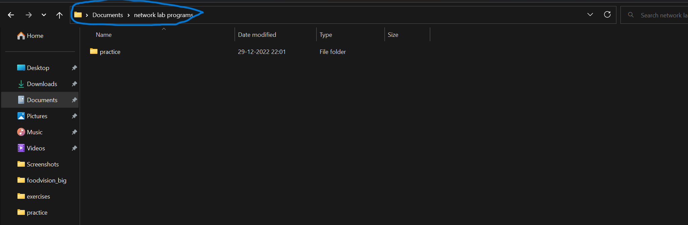

# Network and Communication lab excercises

This repository contains socket programmming in Java

**Step by Step Instructions to run the programs:**
1. Open Notepad and type in the program.
2. Save the file with the extention .java
3. Open the folder where the file is stored and type cmd in the address bar and press enter.(This is shown in the below image).
4. Now command prompt window will be appeared.
5. Type `javac filename.java` and press enter. (First server program should be run in order to correctly run the programs)
>**Note:** Filename should be same as public class name.
6. Repeat the steps from 3 to 5 for client program also.

